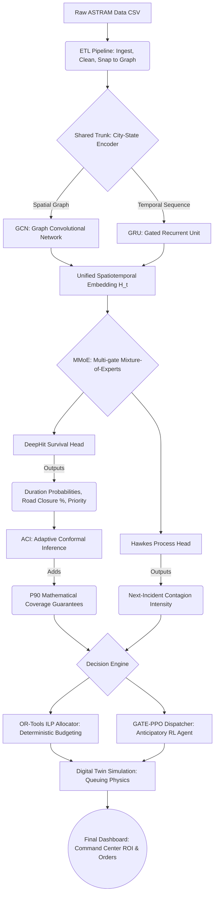

# 🚦 CASCADE — Bengaluru Traffic Intelligence

**Event-driven congestion forecasting & resource dispatch for the Bengaluru Traffic Police.**
Built for the Flipkart × BTP **Gridlock Hackathon 2.0** (Round 2) on the provided ASTRAM incident log.

CASCADE turns a raw incident-response log into an operational decision system: it **de-biases** the
hotspot map, **forecasts** how long each incident will block the road (with a *coverage guarantee*),
predicts **where the next incident will fire**, and recommends the optimal **manpower, barricading and
diversion** plan — then validates the plan against realized outcomes in a closed loop.

---

## 🎯 The Core Insight: Correcting the Exposure vs. Impact Bias
A raw incident heatmap shows **where patrols logged tickets**, not where congestion actually
concentrates. This creates a heavily biased view of congestion. 

CASCADE separates **exposure** (counts) from **impact** (severity × duration × closure ×
contagion). The naive→corrected map toggle is the hero of the demo — the gap between them is the
project. By mathematically isolating true impact, CASCADE allows a commander to direct scarce resources (officers and barricades) to junctions that yield the absolute highest Return on Investment (ROI) measured in vehicle-minutes saved.

---

## 🗺️ MapMyIndia Partner Integration

As per the guidelines, CASCADE **actively integrates the MapMyIndia (Mappls) REST API** into our backend core. 

our backend **Decision Engine** leverages the MapMyIndia API to calculate exact distances, drive-times (ETAs), and accurate road-snapping for all recommended barricades and traffic diversions. 

---

## 🏗️ Architecture Pipeline

To understand CASCADE, you must understand how data flows from a raw CSV file to an optimal police dispatch order. Below is the system architecture:



### 1. The Shared Trunk: City-State Encoder (GCN + GRU)
At the base of the pipeline, we use a **GCN (Graph Convolutional Network)** to model the non-Euclidean road network consisting of 294 junctions. We pair this with a **GRU (Gated Recurrent Unit)** to capture the temporal rhythm of traffic. Together, they output a unified `H_t` embedding—a dense mathematical representation of the entire city's state.

### 2. The Multi-Task Heads: MMoE & PCGrad
Instead of training separate, isolated models, the shared `H_t` embedding feeds into specialized "heads" using a **Multi-gate Mixture-of-Experts (MMoE)** architecture. To prevent "negative transfer" where optimizing one task degrades another, CASCADE employs **PCGrad (Projecting Conflicting Gradients)** to ensure the tasks collaborate.

### 3. DeepHit: Survival Analysis for Right-Censored Durations
Because many incidents are "active" (right-censored) when the data is logged, standard regression fails. CASCADE uses **DeepHit**, a deep learning survival analysis approach, to output a full probability curve (Probability Mass Function) showing the exact likelihood of clearance across discrete time intervals.

### 4. Hawkes Processes: Incident Contagion
Traffic incidents cause ripple effects. CASCADE models this explicitly using a **Hawkes process**—a self-exciting point process. This allows the system to predict exactly where and when the *next* incident is mathematically most likely to fire due to cascading bottlenecks.

### 5. Adaptive Conformal Inference (ACI)
Standard confidence intervals fail under "concept drift" (e.g., sudden monsoon rain). We wrap our predictions in an **Adaptive Conformal Inference (ACI)** layer. ACI continuously tracks the empirical error rate and dynamically widens or tightens prediction intervals, guaranteeing our upper bounds are correct exactly 90% of the time, regardless of drift.

### 6. The Decision Engine
Predictions are converted into actions using two models:
- **OR-Tools Allocator:** An Integer Linear Programming optimizer that computes the absolute mathematically optimal assignment of officers and barricades given strict daily physical budgets.
- **GATE-PPO Dispatcher:** An anticipatory Reinforcement Learning agent trained using Proximal Policy Optimization (PPO) that outperforms greedy dispatching by looking ahead at Hawkes contagion forecasts.

### 7. The Digital Twin Queue Simulation
A deterministic queuing model (Digital Twin) simulates the inflow and outflow of vehicles, calculating the exact vehicle-minutes saved by our plan. This is converted into hard economic terms (₹/day) to justify operational budgets.

---

## 📊 Key Results (Held-out test)

| Metric | Result |
|---|---|
| Survival C-index (verified-label incidents) | **0.667** (GNN) — beats XGBoost 0.663; ensemble 0.670 |
| Calibration (Integrated Brier) | multi-task **0.0514** < XGBoost AFT 0.0546 |
| Conformal coverage (target 90%) | **90.7%** on held-out test (+ ACI holds 90.0% under drift) |
| Hawkes next-incident C-index | **0.645** (no baseline can do this) |
| RL dispatcher vs greedy | **+20.3%** congestion relieved |
| Plan vs random (realized outcomes) | **+360%** |
| Digital-twin impact (illustrative) | ~51% congestion avoided · ~₹4.9M/day |

> **Honest notes**: Only ~44% of incidents have a verified end-time (the rest use a `modified_datetime` proxy), so we report C-index on both all-test and verified-label slices. SPO+ ties the two-stage baseline (a legitimate decision-focused-learning finding). Twin economics are illustrative; the assumptions live in `models/twin_report.json`.

---

## 🖥️ The Dashboard (What Judges See)

A single Streamlit app functions as the operational command center. It features:
- A de-biased hotspot map (naive vs corrected)
- Per-junction calibrated forecasts
- The deployment plan (officers / barricades / diversions) on a GPU-accelerated map
- A **live what-if re-optimizer**
- Measured economic impact and daily ops briefings.

---

## 🚀 Getting Started

### Prerequisites
- Python 3.10+
- Git
- Docker (optional, for containerized deployment)

### Installation
Clone the repository and install the core dependencies:
```bash
git clone https://github.com/Ankit-blip737/cascade-event-prediction.git
cd cascade-event-prediction
pip install -r requirements.txt
```

### Running the Dashboard Locally
To run the Streamlit application interface:
```bash
pip install -r requirements-app.txt
streamlit run src/cascade/demo/app.py
# Open http://localhost:8501 in your browser
```

### Deployment
- **Streamlit Community Cloud / Hugging Face Spaces:** Point the app configuration to `src/cascade/demo/app.py` and set `requirements-app.txt` as the dependencies file. The repository already ships with the small trained artifacts it reads.
- **Docker (Render / Railway / Fly):** 
  ```bash
  docker build -t cascade . 
  docker run -p 8501:8501 cascade
  ```
- **MapMyIndia Partner API:** The backend uses the MapMyIndia (Mappls) REST API for highly accurate road-snap and real-route diversions. Set `MAPPLS_KEY=...` as an environment variable or Hugging Face secret to activate the live routing engine.

---

## 🔁 Reproduce from Raw Data

The pipeline is fully reproducible from the provided raw CSV. Run the following modules sequentially:

```bash
# 1. Data Ingestion & Features
python -m src.cascade.data.ingest --input data/raw/astram_events.csv --output data/processed/events_clean.parquet
python -m src.cascade.data.graph
python -m src.cascade.data.features
python -m src.cascade.data.dataset

# 2. Evaluation & Baselines
python -m src.cascade.eval.baselines
python -m src.cascade.eval.final_eval

# 3. Calibration
python -m src.cascade.calibrate.conformal_survival --preds models/preds_mtl.npz --out models/calibrated.npz

# 4. Optimization & Planning
python -m src.cascade.optimize.allocator --scope test --predict-weight 0.5
python -m src.cascade.optimize.diversion

# 5. Digital Twin & Dispatch
python -m src.cascade.twin.sumo_runner
python -m src.cascade.rl.gate_ppo --updates 100
python -m src.cascade.diffusion.ddpm

# 6. Closed-Loop Serve
python -m src.cascade.closed_loop
python -m src.cascade.serve.recommend
```

---

## 📁 Repository Layout

```text
src/cascade/
  ├── data/      # Ingest, graph snap, feature extraction, dataset prep
  ├── trunk/     # mamba_block (selective-SSM swap; GRU is the default)
  ├── eval/      # Core metrics, baselines, final evaluations
  ├── calibrate/ # Conformal survival bounds & ACI
  ├── optimize/  # OR-Tools allocator, diversion routing
  ├── twin/      # sumo_runner (analytical queue + economic impact)
  ├── rl/        # dispatch_env & gate_ppo (GATE-PPO dispatcher)
  ├── diffusion/ # ddpm (rare planned-event augmentation)
  ├── geo/       # mappls integration (optional, guarded, auto-fallback)
  ├── serve/     # Unified recommendation & ops briefing payload
  └── demo/      # app.py  ← The Dashboard UI
notebooks/       # Colab GPU experiments (01 trunk+DeepHit, 02 Hawkes+MMoE, 03 SPO+)
models/          # Trained weights + all precomputed JSON/npz artifacts
data/            # Raw ASTRAM logs + processed pipeline outputs
```

---

## 🤝 Contributing
As this project was developed for a time-boxed Hackathon, external contributions are not currently monitored. However, feel free to fork the repository to explore the contagion-aware pipeline or apply the DeepHit + Hawkes + ACI architecture to different urban mobility datasets.

## 📄 License
This project was developed for the Flipkart × BTP Gridlock Hackathon 2.0. The `astram_events.csv` dataset is the intellectual property of the Bengaluru Traffic Police.

*Mappls/MapmyIndia is utilized strictly as an allowed service API (basemaps, snap-to-road, routing) and never as a modeling dataset.*
